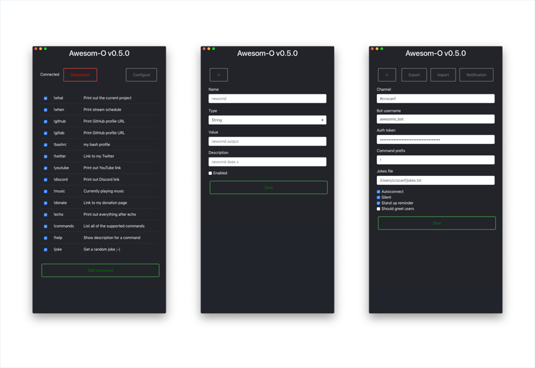

# Awesom-o

A Twitch bot to receive chat messages as native notifications on your desktop.

Built live on [Twitch][c]. Hour long videos available on [YouTube][0].

## Releases

Builds for Windows, Linux and macOS are available, please visit the [release
page][1].

## Development

    make install_deps
    make run

or

	git clone https://github.com/scanf/Awesom-o /tmp/Awesom-o && \
	npm install /tmp/Awesom-o && \
	electron /tmp/Awesom-o

## Features

The bot supports adding user defined commands which could be values like your
Twitter profile URL or text files to show what music is currently being played.

Some commands are builtin like `help`, `joke`, and `commands`. These can not be
edited but can be disabled. The `joke` command can be configured further from
the configure page to set the text file to use for jokes.

## License

[CC0 1.0 (Public Domain)](LICENSE.md)

[c]: https://www.twitch.tv/ccscanf
[0]: https://www.youtube.com/playlist?list=PL6ETvzpSGtt3XnmnBtmAldrpGA0lK6uAG
[1]: https://github.com/scanf/Awesom-o/releases
