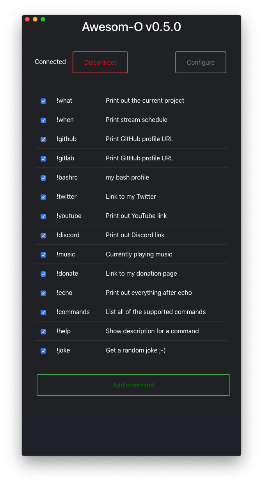
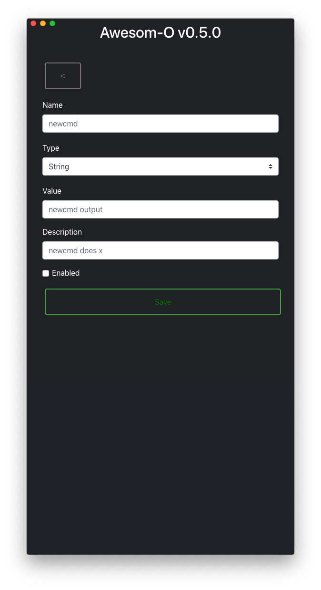

# Awesom-o

> Note: this is a work in progress, use at your own risk!

A Twitch bot to receive chat messages as native notifications on macOS.

This app was mostly built live on https://www.twitch.tv/ccscanf
Hour long videos available on [YouTube](https://www.youtube.com/playlist?list=PL6ETvzpSGtt3XnmnBtmAldrpGA0lK6uAG)

## Running locally

    make install_deps
    make run

or

	git clone https://github.com/scanf/Awesom-o /tmp/Awesom-o && \
	npm install /tmp/Awesom-o && \
	electron /tmp/Awesom-o

## Features

The bot supports adding user defined commands which could be values like your
Twitter profile URL or text files to show what music is currently being played.

## Screenshots

## License

[CC0 1.0 (Public Domain)](LICENSE.md)
